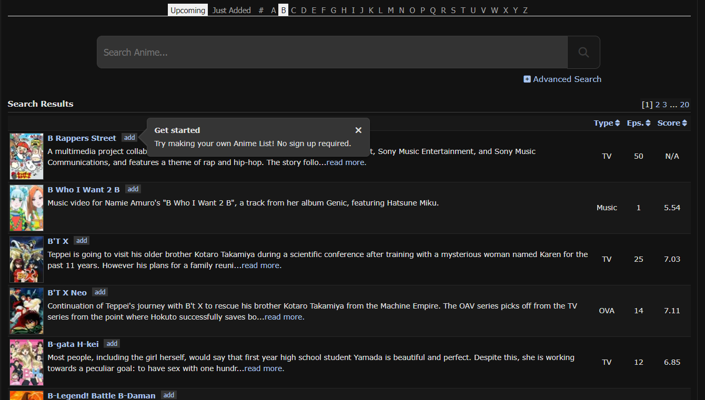

# MyAnimeScraper

MyAnimeScraper is a web scraper specifically designed for extracting data from the website MyAnimeList. I've finnaly managed to release this third version that is much more simple, but working.

## The process
### Iterate through all letters
Basically iterate through the MAL search page, and goes through every possible letter (here letter 'B').

Once on a letter page, it checks the maximum of subpages number (here 20), and scrap all the animes on all these pages. 

### Anime informations

The current version take all the informations on the anime landing page : it goes from the cover picture, to the statistical numbers (like rank, popularity, members), to details informations (title, studios, licensors, season).

The scraper tend to be exhaustive when retrieving informations.

## How to use it ?
Incoming

## Future Improvements
Incoming